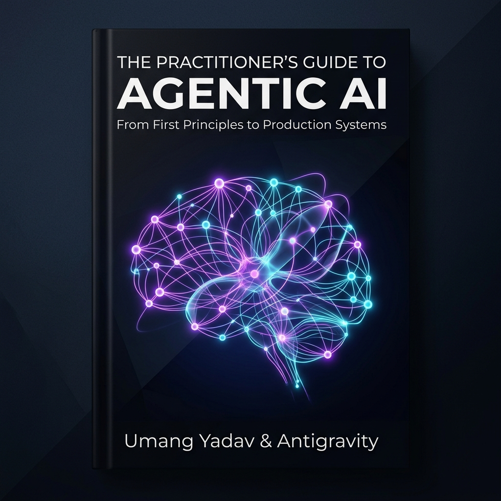

# The Practitioner's Guide to Agentic AI: From First Principles to Production Systems

<p align="center">
  
</p>

---

## 📖 Access the Book
The complete, compiled **87-page conceptual handbook** is available as a PDF in the root of this repository:
👉 **[Download book.pdf](./book.pdf)**

---

## 🚀 Overview

Welcome to the definitive companion repository for **The Practitioner's Guide to Agentic AI** by **Umang Yadav & Antigravity**. 

This repository implements a **dual-track learning framework**:
1. **Conceptual & Architectural Track (`book.pdf`)**: A comprehensive textbook covering deep learning internals, cyclic execution models, sandboxed virtual environments, distributed tracing, economics, fine-tuning alignment, and interview prep.
2. **Hands-on Lab Track (`coding-handbook/`)**: Self-contained, runnable Python code files implementing the core algorithms discussed in the book.

---

## 📁 Repository Structure

```bash
├── book.pdf             # The complete compiled 87-page book (PDF)
├── cover.png            # Front cover art
└── coding-handbook/     # Companion Python implementations
    ├── README.md        # Lab index and quickstart guide
    ├── requirements.txt # Python dependencies
    ├── ch01_llm_anatomy/ # scaled dot-product attention, KV Cache, BPE
    ├── ch02_reasoning/   # dynamic temp, logit forcing, CFG Grammar logit masking
    ├── ch03_react/       # ReAct loops, self-healing, R1 think tag parsing
    ├── ch04_tool_calling/ # async execution, security sanitizers, computer use mapping
    ├── ch05_embeddings/  # asymmetric vector similarity metrics
    ├── ch06_vector_db/   # HNSW graph search, AST chunkers, Graph RAG query
    ├── ch07_context_assembly/ # sliding windows, MemGPT paged memory stores
    ├── ch08_code_interpreter/ # microVM container isolation execution
    ├── ch09_mcp/         # Model Context Protocol JSON-RPC Lifecycles
    ├── ch10_multi_agent/ # LangGraph DAG topological sorting & checkpointing
    ├── ch11_ai_ides/     # line-by-line Myers Diff algorithm & AST verification
    ├── ch12_agentic_sdks/ # graph state checkpoint serializers
    ├── ch14_evaluation/  # LLM-as-judge, benchmark suites, red-team injection tests
    ├── ch15_observability/ # OpenTelemetry trace spans, Prometheus metrics
    ├── ch16_economics/   # hierarchical cost routers, streaming TTFT measures
    ├── ch17_fine_tuning/ # synthetic teacher pipelines, LoRA configurations, DPO builders
    └── ch18_github_agent/ # webhook server, PR bug search, comment poster API
```

---

## 🛠️ Quick Start

To run the Python labs inside the `coding-handbook/`:

```bash
# Clone the repository
git clone https://github.com/umang-algo/agentic-ai-handbook.git
cd agentic-ai-handbook/coding-handbook

# Create and activate a virtual environment
python3 -m venv .venv && source .venv/bin/activate

# Install dependencies
pip install -r requirements.txt

# Export your API keys (required for LLM integrations)
export OPENAI_API_KEY="your-key"
export ANTHROPIC_API_KEY="your-key"
export GITHUB_TOKEN="your-token"
```

Every chapter folder has its own `README.md` detailing the learning goals and expected scripts.

---

## 🎓 Mapped Course
This handbook is directly aligned with the **AI Agent Masterclass** repository. Explore the notebooks there:  
🔗 **[umang-algo/AI-Agent-Masterclass](https://github.com/umang-algo/AI-Agent-Masterclass)**

---

## ✍️ Authorship & Collaboration
- **Umang Yadav**: Creator & AI Architect
- **Antigravity**: Pair Programmer (Autonomous Agentic Coding Agent created by the Google DeepMind team)

Released under the **MIT License**.
