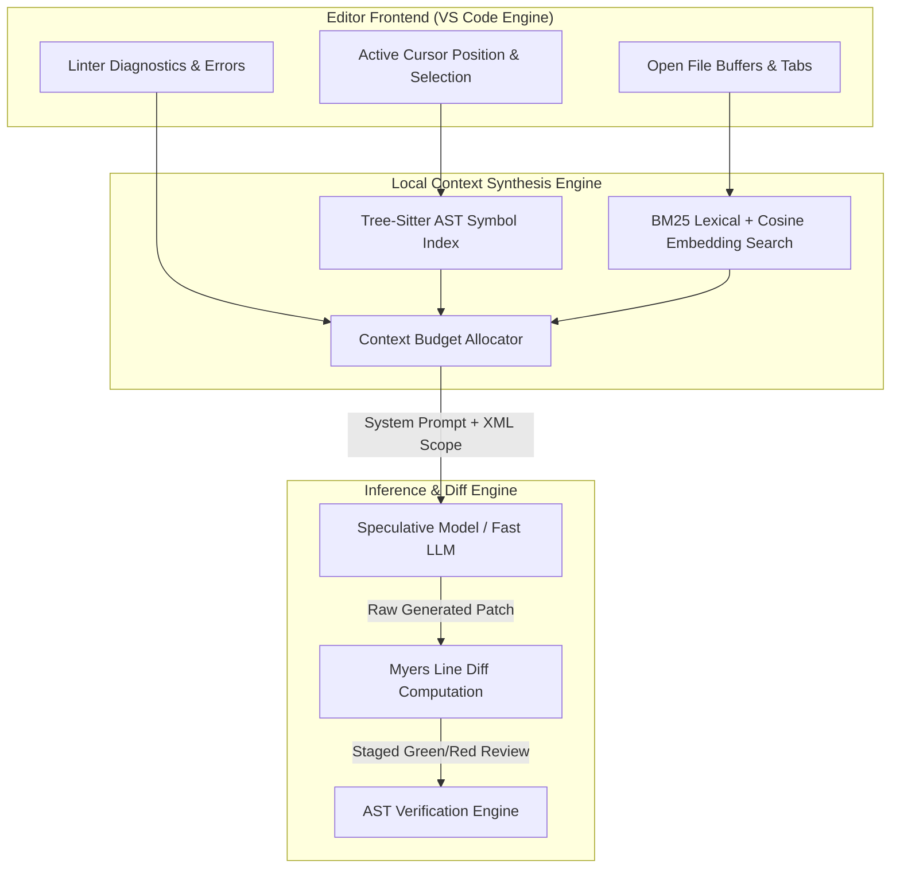

# Chapter 11: The Architecture of Modern AI IDEs (Cursor, Claude Code, Canvas)

> 📝 **Coding Handbook**: Practice the code from this chapter → [`coding-handbook/ch11_ai_ides`](../coding-handbook/ch11_ai_ides/)

AI coding platforms like Cursor, Claude Code, and ChatGPT Canvas differ fundamentally from standard code generation API endpoints. They do not simply output code blocks on demand; they run continuous, background-driven coordination loops that monitor workspace diagnostics, maintain real-time AST symbol indices, and apply edits directly to active file buffers.

---

## 11.1 The AI IDE Execution Loop Architecture

When a user invokes an inline prompt (e.g. `Cmd-K` or `/fix`), the AI IDE does not blindly send the entire repository context to an LLM. It executes a multi-stage background pipeline:



### Key Stages of the AI IDE Pipeline:
1. **Context Aggregation**: Collects active file buffers, diagnostics, selection ranges, and AST import hierarchies.
2. **Speculative Generation**: Uses smaller, sub-100ms local/edge models for inline autocomplete predictions before passing complex edits to frontier models.
3. **Line-Level Patching**: Computes exact line insertions and deletions using variants of the Myers Diff Algorithm rather than rewriting entire files.
4. **AST Verification**: Parses modified files through language-specific AST parsers to ensure edits do not introduce syntax or scope errors before committing changes.

---

## 11.2 The Myers Diff Algorithm in AI Code Generation

Standard LLM outputs often produce minor whitespace discrepancies or redundant code blocks. Rewriting a 1,000-line file to change 3 lines causes:
- High output latency (proportional to generated token count).
- Unintended edits to unrelated functions.
- High API token costs.

Modern AI IDEs instruct the model to produce search/replace blocks or raw unified diffs, and use the **Myers Diff Algorithm** to compute the shortest edit script (SES).

### Mathematical Definition
Given two sequences $A = (a_1, a_2, \dots, a_N)$ and $B = (b_1, b_2, \dots, b_M)$, the algorithm models the edit process as a grid graph walk from $(0,0)$ to $(N,M)$:
- Moving right: Deletion from sequence $A$.
- Moving down: Insertion into sequence $B$.
- Moving diagonally: Exact character/line match (cost = 0).

```python
# Myers Diff shortest edit script conceptual loop
def myers_diff(a: list[str], b: list[str]) -> list[str]:
    N, M = len(a), len(b)
    MAX = N + M
    v = {1: 0}
    trace = []

    for d in range(0, MAX + 1):
        for k in range(-d, d + 1, 2):
            if k == -d or (k != d and v.get(k - 1, -1) < v.get(k + 1, -1)):
                x = v.get(k + 1, 0)
            else:
                x = v.get(k - 1, 0) + 1
            y = x - k

            while x < N and y < M and a[x] == b[y]:
                x, y = x + 1, y + 1

            v[k] = x
            if x >= N and y >= M:
                return trace  # SES found in O((N+M)D) time
```

---

## 11.3 AST Verification & Safety Gates

Before an edit is applied to the developer's live workspace buffer, it passes through an **AST Verification Engine**:

```python
import ast

def verify_code_integrity(original_code: str, patched_code: str) -> bool:
    try:
        # Step 1: Ensure valid syntax
        tree_orig = ast.parse(original_code)
        tree_patch = ast.parse(patched_code)

        # Step 2: Ensure critical symbols (e.g. exported classes) are preserved
        orig_classes = {n.name for n in ast.walk(tree_orig) if isinstance(n, ast.ClassDef)}
        patch_classes = {n.name for n in ast.walk(tree_patch) if isinstance(n, ast.ClassDef)}

        if not orig_classes.issubset(patch_classes):
            return False  # Agent deleted a required class definition

        return True
    except SyntaxError:
        return False  # Patch introduced syntax error
```

---

## 11.4 Comparative Architecture: Cursor vs Claude Code vs Canvas

| Metric / Dimension | Cursor (IDE Fork) | Claude Code (Terminal CLI) | ChatGPT Canvas (Web GUI) |
|--------------------|-------------------|-----------------------------|--------------------------|
| **Primary Environment** | Native VS Code Fork | Host Terminal Engine | Web-based Monaco Editor |
| **Context Indexing** | Tree-sitter AST + BM25 | File Grep + Extended Thinking | Web Session State |
| **Diff Engine** | Myers Line-Level Staging | Unified Patch Applicator | Full Document Rewrite |
| **Execution Safety** | Inline Buffer Staging | Terminal Confirmation Prompts | Isolated Web Sandbox |
