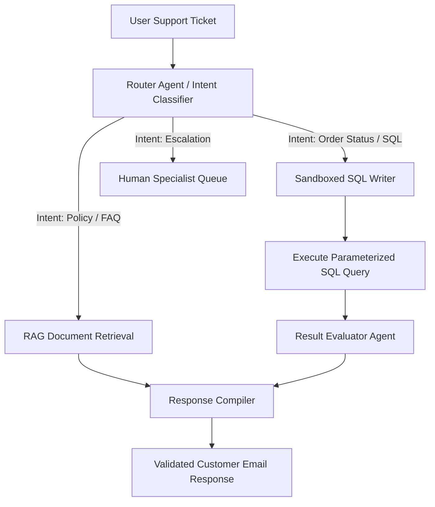
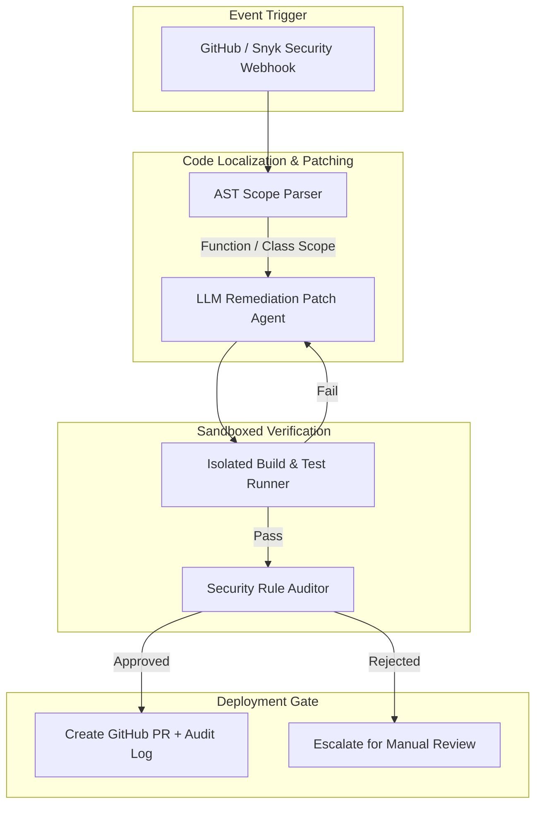
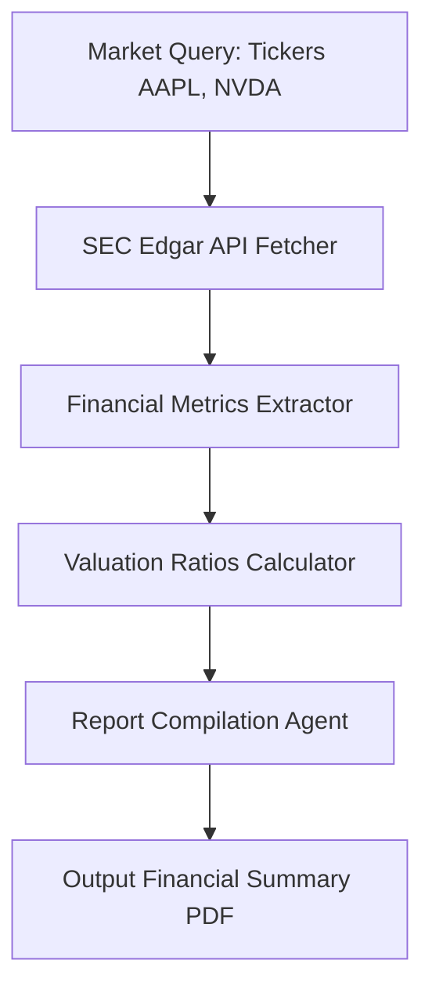

# Chapter 13: Enterprise Architectures & Solution Design

> 📝 **Coding Handbook**: Practice the code from this chapter → [`coding-handbook/ch13_enterprise_architectures`](../coding-handbook/ch13_enterprise_architectures/)

Traditional software architectures struggle with unstructured inputs (e.g. emails, security webhooks, financial filings). Agentic enterprise architectures bridge this gap by acting as deterministic translators between unstructured data streams and sandboxed code execution environments.

Below are three complete, production-ready enterprise architectures.

---

## 13.1 Use Case 1: Autonomous Customer Support Query Router

This architecture intercepts incoming customer support tickets, extracts intent, routes between RAG knowledge bases and sandboxed SQL execution databases, and evaluates responses before replying to the customer.

### Key Security & Integrity Mechanics:
1. **Parameterized SQL Sanitization**: Protects against SQL injection by enforcing strict parameterized queries rather than executing raw LLM SQL strings.
2. **Result Evaluation**: A secondary evaluator agent checks database query outputs to verify whether the order status answer satisfies the customer's request.

---

## 13.2 Use Case 2: DevSecOps Vulnerability Patching Pipeline

This agentic pipeline listens to static security webhooks (e.g. Snyk, GitHub CodeQL), parses line-level alerts, uses AST parsing to locate the containing function/class scope, generates a targeted patch in an isolated build sandbox, and runs unit tests before creating a Pull Request.

### Technical Workflow:
1. **AST Scope Localization**: Identifies the exact `ast.FunctionDef` enclosing line 42 of a flagged vulnerability.
2. **Sandboxed Verification**: Runs unit tests in a lightweight container before any code is committed.
3. **Automated PR Creation**: Posts a clean git branch with the proposed remediation and audit logs.

---

## 13.3 Use Case 3: Financial Market SEC Aggregator

This architecture compiles multi-page financial reports by dynamically querying SEC Edgar filings, calculating valuation multiples, generating chart visualizations, and outputting compiled reports.

### Mathematical Valuation Formulas
- **Net Margin (%):**
  $$\text{Net Margin} = \left(\frac{\text{Net Income}}{\text{Total Revenue}}\right) \times 100$$
- **Price-to-Earnings (P/E) Ratio:**
  $$\text{P/E Ratio} = \frac{\text{Market Price per Share}}{\text{Earnings per Share (EPS)}}$$

---

## 13.4 Architecture Comparison Matrix

| Enterprise Architecture | Primary Data Source | Verification Mechanism | Human Gate Requirement |
|-------------------------|---------------------|------------------------|------------------------|
| **Customer Support Router** | Email / Tickets | SQL Result Evaluator | Escalation Queue |
| **DevSecOps Patcher** | Security Webhooks | Sandboxed Pytest Suite | PR Code Review |
| **Financial Aggregator** | SEC Edgar / Market Feeds | Financial Audit Check | Output PDF Approval |
