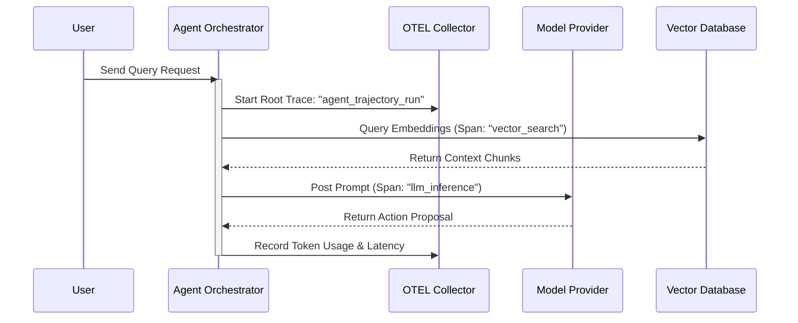

# Chapter 15: Observability, Tracing, and the Agent Debugger

> 📝 **Coding Handbook**: Practice the code from this chapter → [`coding-handbook/ch15_observability`](../coding-handbook/ch15_observability/)

Debugging a traditional monolith requires inspecting stack traces. Debugging a multi-agent system requires tracing non-deterministic trajectories across dozens of LLM calls, tool executions, and state transitions. Without structured observability, diagnosing why an agent failed or hallucinates becomes impossible.

---

## 15.1 Distributed Tracing with OpenTelemetry Spans

In production agentic architectures, every step in a ReAct loop or multi-agent state graph is wrapped in an **OpenTelemetry (OTEL) Trace Span**:



### Essential Trace Span Attributes:
- `agent.step_number`: Iteration index within trajectory.
- `llm.prompt_tokens`: Count of input context tokens.
- `llm.completion_tokens`: Count of generated output tokens.
- `llm.time_to_first_token_ms`: TTFT latency.
- `agent.action_name`: Name of invoked tool call.

---

## 15.2 Key Latency & Token Metrics (Prometheus)

Production agent telemetry relies on four core metrics tracked in Prometheus:

1. **Time-to-First-Token (TTFT)**: Latency from HTTP request start to the arrival of the first generated token stream chunk.
2. **Tokens-Per-Second (TPS)**: Throughput speed of generation:
   $$\text{TPS} = \frac{N_{\text{tokens}}}{\Delta t_{\text{generation}}}$$
3. **Trajectory Step Count**: Number of ReAct loops executed before reaching `<Final>` answer.
4. **Token Cost per Trajectory**: Cumulative USD cost incurred.

---

## 15.3 Shannon Entropy for Agent Uncertainty Debugging

When an agent becomes uncertain, its output token probability distribution flattens. We calculate **Shannon Entropy** over token logit probabilities to detect agent confusion or hallucination risk in real-time:

### Mathematical Definition
$$H(X) = -\sum_{i=1}^N P(x_i) \log_2 P(x_i)$$

```python
import math

def calculate_token_entropy(token_probabilities: list[float]) -> float:
    """
    Calculates Shannon Entropy (bits).
    Low entropy (<1.5): Confident decision.
    High entropy (>2.5): Agent is uncertain/hallucinating.
    """
    entropy = 0.0
    for p in token_probabilities:
        if p > 0.0:
            entropy -= p * math.log2(p)
    return round(entropy, 4)
```

---

## 15.4 Agent Trajectory Debugging Checklist

When investigating an agent failure in production:

1. **Check TTFT vs TPS**: If TTFT is high, context size is too large (KV Cache bottleneck). If TPS is low, model generation bandwidth is constrained.
2. **Check Action Hashes**: Verify if the loop detection guardrail was triggered due to duplicate action proposals.
3. **Inspect Tool Payload**: Verify if raw JSON tool arguments match expected OpenAPI Pydantic schemas.
4. **Evaluate Token Entropy**: Identify steps where token entropy spikes above $2.5$ bits to pinpoint hallucination sources.
