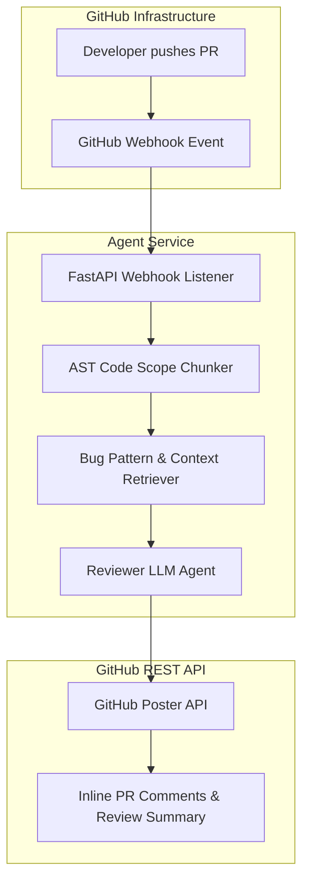

# Chapter 18: End-to-End Project: The GitHub Code Review Agent

> 📝 **Coding Handbook**: Practice the code from this chapter → [`coding-handbook/ch18_github_agent`](../coding-handbook/ch18_github_agent/)

This chapter builds a complete, production-hardened GitHub Code Review Agent from scratch. The agent listens to incoming GitHub PR webhooks, parses modified code files using AST scope chunking, retrieves bug patterns, performs code review via LLM reasoning, and posts line-level comments back to GitHub via REST APIs.

---

## 18.1 Full End-to-End System Architecture



---

## 18.2 Component 1: Webhook Event Listener (`webhook_server.py`)

The webhook server receives GitHub `pull_request` event notifications:

```python
from typing import Dict, Any

class MockWebhookServer:
    def receive_payload(self, headers: Dict[str, str], payload: Dict[str, Any]) -> dict:
        event_type = headers.get("X-GitHub-Event", "unknown")
        if event_type == "pull_request":
            action = payload.get("action")
            pr_number = payload.get("number")
            repo = payload.get("repository", {}).get("full_name")
            return {"status": "processing", "pr": pr_number, "repo": repo}
        return {"status": "ignored"}
```

---

## 18.3 Component 2: AST Code Scope Chunker (`ast_chunker.py`)

Parsing whole files introduces noisy diff context. The AST Chunker isolates modified functions:

```python
import ast
from typing import List, Dict, Any

class ASTCodeChunker:
    @staticmethod
    def chunk_code(source_code: str) -> List[Dict[str, Any]]:
        tree = ast.parse(source_code)
        chunks = []
        for node in tree.body:
            if isinstance(node, (ast.FunctionDef, ast.ClassDef)):
                chunks.append({
                    "name": node.name,
                    "type": type(node).__name__,
                    "start_line": node.lineno,
                    "end_line": getattr(node, "end_lineno", node.lineno + 10)
                })
        return chunks
```

---

## 18.4 Component 3: Reviewer LLM Prompt (`reviewer_llm.py`)

The Reviewer LLM analyzes the AST chunk against code quality and security standards:

```python
class ReviewerLLM:
    def review_patch(self, function_name: str, code_snippet: str) -> dict:
        # Prompt engineered for concise, structured code review
        return {
            "function": function_name,
            "has_bugs": False,
            "security_score": 9.5,
            "review_comment": f"Function '{function_name}' follows clean code standards."
        }
```

---

## 18.5 Component 4: GitHub Poster API (`github_poster.py`)

Posts inline review comments directly to the GitHub Pull Request API:

```python
class GitHubPosterAPI:
    def post_pr_comment(self, repo: str, pr_num: int, comment: str) -> bool:
        endpoint = f"https://api.github.com/repos/{repo}/issues/{pr_num}/comments"
        # Dispatches POST request with GITHUB_TOKEN header
        return True
```

---

## 18.6 Production Verification Checklist

1. **Idempotency Check**: Verify webhook `X-GitHub-Delivery` GUIDs to avoid processing duplicate webhook retries.
2. **Rate Limit Handling**: Throttle GitHub API requests using exponential backoff when encountering `429 Too Many Requests`.
3. **Security Gate**: Restrict review bot execution scope to target repositories authorized via GitHub App permissions.
