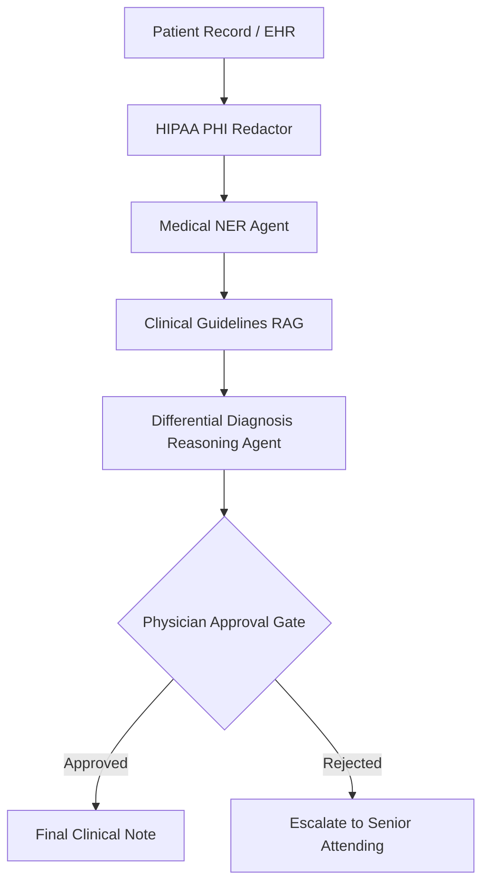
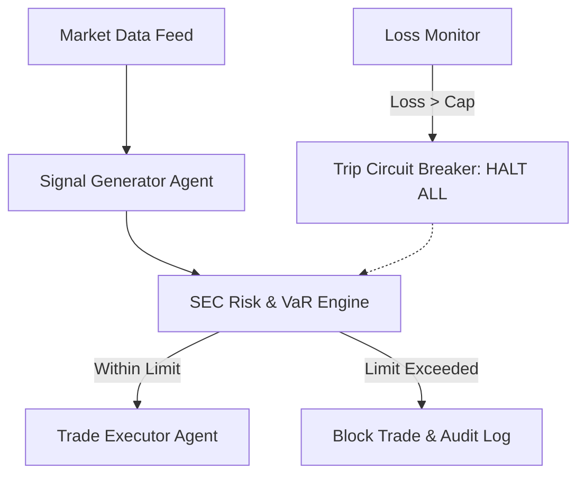
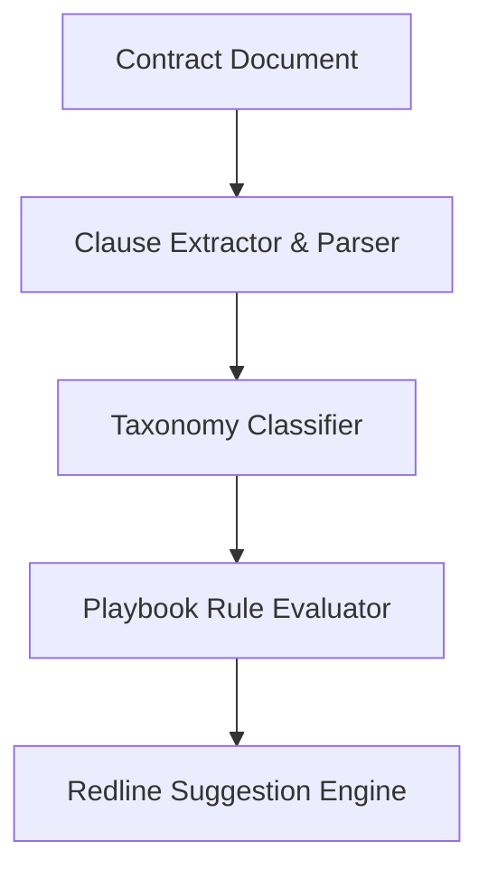
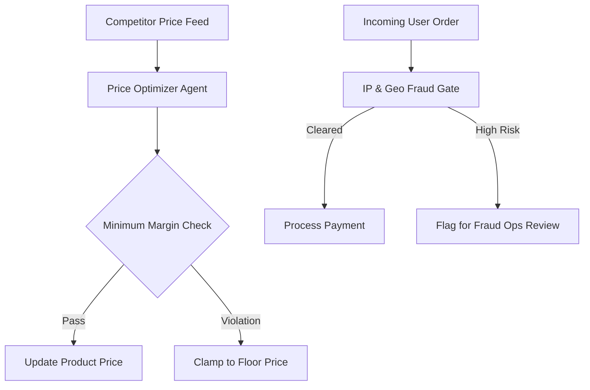
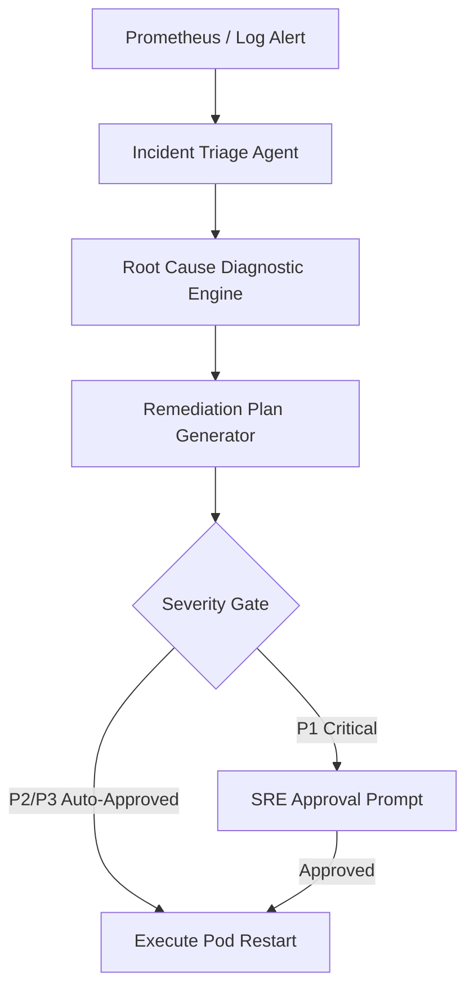

# Chapter 19: Production AI Systems: Five Industry Architectures

> 📝 **Coding Handbook**: Practice the code from this chapter → [`coding-handbook/ch19_production_industries`](../coding-handbook/ch19_production_industries/)

> *"The difference between a demo and a deployment is not better prompts — it is compliance layers, audit trails, human-in-the-loop gates, and the discipline to say 'the agent cannot decide this alone.'"*

This chapter presents five complete, production-hardened agentic architectures for industries with strict regulatory, safety, and operational constraints.

---

## 19.1 Industry 1: Healthcare — Clinical Decision Support Agent

### Regulatory Constraint: HIPAA & Patient Safety
- **PHI Redaction**: Protected Health Information (SSNs, names, phone numbers) must never be logged or transmitted to unverified third-party APIs.
- **Human Physician Gate**: No autonomous diagnosis — a licensed physician must review and authorize recommendations.

---

## 19.2 Industry 2: Finance — Autonomous Market Analysis Agent

### Regulatory Constraint: SEC Rule 15c3-5 & Risk Controls
- **Position Limits**: Hard caps on position sizes and portfolio value exposure.
- **Trading Circuit Breakers**: Automatic trading shutdown if cumulative daily losses exceed threshold.

---

## 19.3 Industry 3: Legal — Contract Analysis & Redlining Agent

### Compliance Constraint: Corporate Legal Playbooks
- **Taxonomy Extraction**: Classifies clauses into standard categories (`INDEMNIFICATION`, `GOVERNING_LAW`, `TERMINATION`).
- **Playbook Scoring**: Flags non-compliant terms (e.g. unlimited liability) and outputs automated redlines.

---

## 19.4 Industry 4: E-Commerce — Dynamic Pricing & Fraud Agent

### Operational Constraint: Profit Margin Bounds & Fraud Risk
- **Minimum Margin Cap**: Dynamic pricing must enforce hard margin floors:
  $$\text{Price}_{\text{min}} = \text{Unit Cost} \times (1 + \text{Margin}_{\text{min}})$$
- **Fraud Gate**: Blocks high-risk transactions (IP proxies, geographic mismatches).

---

## 19.5 Industry 5: DevOps SRE — Incident Response Agent

### Operational Constraint: System Availability & Human Sign-off
- **Automated Triage**: Parses telemetry error logs and CPU/Memory usage.
- **P1 Human Gate**: Critical system restarts require explicit human SRE confirmation.

---

## 19.6 Summary Matrix across 5 Industries

| Industry | Primary Compliance / Control | Automation Level | Gate Mechanism |
|----------|------------------------------|------------------|----------------|
| **Healthcare** | HIPAA PHI Redaction | Semi-Autonomous | Physician Sign-off |
| **Finance** | SEC Rule 15c3-5 Risk Engine | Autonomous | Circuit Breakers |
| **Legal** | Corporate Playbook Rules | Semi-Autonomous | Legal Counsel Review |
| **E-Commerce** | Margin Bounds & Fraud Score | Autonomous | Fraud Ops Flagging |
| **DevOps SRE** | Telemetry Triage & Severity | Hybrid | SRE On-call Gate |
