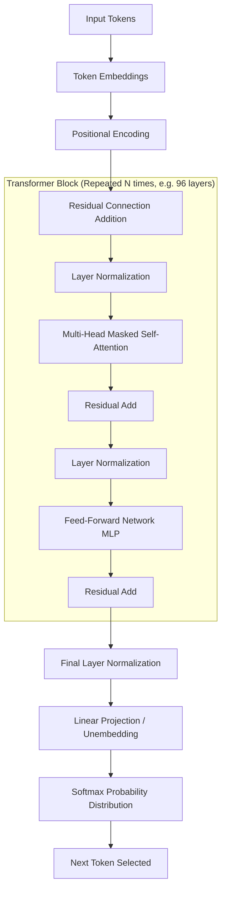

# Chapter 1: The Anatomy of an LLM (Architectural Deep Dive)

> 📝 **Coding Handbook**: Practice the code from this chapter → [`coding-handbook/ch01_llm_anatomy`](../coding-handbook/ch01_llm_anatomy/)

To build deterministic, production-grade Agentic AI, you must stop treating the LLM as a "black box" intelligence and start treating it as what it is: a highly complex, hardware-bound statistical inference engine.

If you do not understand how an LLM tokenizes input, how it allocates VRAM for the KV Cache, or the exact flow of matrices through a Transformer block, you will not understand why your agent hallucinates, runs out of memory, or fails to parse tool calls.

## 1.1 The Exact Transformer Block Architecture

Modern LLMs (like GPT-4, Llama-3, Claude) use a Decoder-only Transformer architecture. Below is the exact data flow for a single forward pass.



### 1.1.1 Tokenization: The Byte-Pair Encoding (BPE)
LLMs do not read words; they read integer IDs mapped to byte-sequences. OpenAI models use `tiktoken` (cl100k_base or o200k_base vocabularies).

*   **Exact mechanics:** The BPE algorithm scans the training corpus and iteratively merges the most frequently occurring byte pairs. 
*   **Agentic Implication:** Code syntax (like `def __init__(self):`) is often compressed into single tokens if common, or shattered into multiple tokens if rare. If you design an Agent to output a custom, highly obscure XML format, you are forcing the model to output sub-optimal, fragmented tokens, severely degrading its reasoning capabilities and slowing down generation speed. Stick to standard JSON.

## 1.2 The Hardware Constraint: VRAM and the KV Cache

When an agent executes a massive RAG search and assembles a 100k token prompt, where does that data go? It goes into GPU VRAM, specifically into the **Key-Value (KV) Cache**.

### The KV Cache Math
During generation, the LLM must attend to all previous tokens. Re-computing the Query, Key, and Value matrices for the entire 100k prefix *every time it generates a single new token* would take minutes per token. 

Instead, the model caches the $K$ and $V$ matrices for all previous tokens in VRAM.

**Exact Memory Calculation per Token:**
$$ \text{Memory}_{\text{token}} = 2 \times \text{num\_layers} \times \text{num\_heads} \times \text{head\_dim} \times \text{precision\_bytes} $$
*Where 2 accounts for storing both K and V.*

For a model like **Llama-3 70B**:
- Layers = 80
- Heads = 64 (Grouped Query Attention reduces this, but assuming standard Multi-Head)
- Head Dim = 128
- Precision = 2 bytes (FP16/BF16)

$2 \times 80 \times 64 \times 128 \times 2 = 2.6 \text{ MB}$ per token.

If your Agent's prompt is **128,000 tokens** (Cursor's max context), the KV cache alone requires:
$128,000 \times 2.6 \text{ MB} = \mathbf{332 \text{ GB of VRAM}}$ per user request.

**Agentic Implication:** Context Assembly (Chapter 7) is not just about prompt quality; it is a hard infrastructure constraint. Sending irrelevant files to the LLM will OOM (Out of Memory) your inference servers. 

## 1.3 The Math: Scaled Dot-Product Attention

To understand *why* irrelevant context ruins agent performance, look at the attention equation.

$$ \text{Attention}(Q, K, V) = \text{softmax}\left(\frac{QK^T}{\sqrt{d_k}}\right)V $$

### The Code Implementation
Here is the exact NumPy implementation of this operation.

```python
import numpy as np

def scaled_dot_product_attention(Q, K, V, d_k, mask=None):
    """
    Computes masked scaled dot-product attention (Decoder-only behavior).
    """
    # QK^T gives the raw attention scores (Logits)
    # Shape: (seq_length, seq_length)
    scores = np.dot(Q, K.T) / np.sqrt(d_k)
    
    # Decoder Masking: Prevent looking into the future
    if mask is not None:
        # We add -infinity to future tokens so softmax turns them to 0
        scores = np.where(mask == 0, -1e9, scores)
    
    # Softmax normalizes the scores across the sequence to sum to 1
    # Shape: (seq_length, seq_length)
    attention_weights = np.exp(scores - np.max(scores, axis=-1, keepdims=True))
    attention_weights /= attention_weights.sum(axis=-1, keepdims=True)
    
    # Multiply by Value matrix
    # Shape: (seq_length, d_v)
    output = np.dot(attention_weights, V)
    
    return output, attention_weights
```

### The "Dilution" Problem
Because of the `softmax` function, the sum of attention weights for any given token is strictly `1.0`. 
If you inject 50 irrelevant files into your Agent's prompt, the attention weights are spread thin across all those tokens. The weights assigned to the *actual instructions* (e.g., "Output strictly JSON") might drop from `0.8` to `0.05`. The model loses focus and hallucinates.

In **Chapter 2**, we will explore how to manipulate the final Softmax distribution to force the model into logical reasoning loops.
