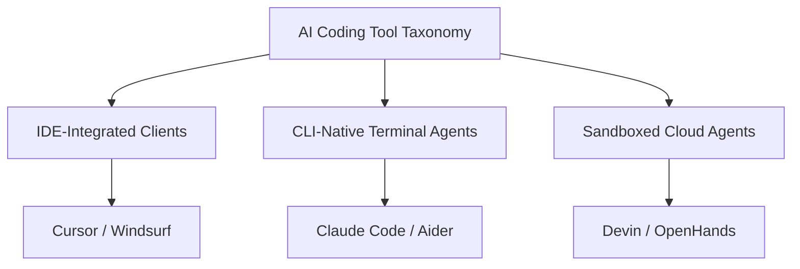

# Chapter 20: AI Harness Tools: Mastering the Agentic Developer Toolkit

> 📝 **Coding Handbook**: Practice the code from this chapter → [`coding-handbook/ch20_ai_harness_tools`](../coding-handbook/ch20_ai_harness_tools/)

> *"In 2023, the best AI coding tool was a chat window. By mid-2025, developers have access to over a dozen autonomous coding agents — some run in IDEs, some in terminals, some in fully sandboxed cloud environments. They all share a common architecture: a ReAct loop, a context engine, a diff applicator, and a permission model."*

This chapter provides an architectural taxonomy of modern AI developer tools (Cursor, Claude Code, Aider, Devin).

---

## 20.1 Architectural Taxonomy

We classify the ecosystem into three core paradigms:

1. **IDE-Integrated Clients (e.g. Cursor)**: Deeply integrated into the editor process buffer. Uses local AST tree-sitter indices and speculative inline completion models for $<100$ms latency.
2. **CLI-Native Terminal Agents (e.g. Claude Code, Aider)**: Git-native agents running in the developer's terminal. Uses extended thinking tokens and client-side command verification prompts.
3. **Sandboxed Cloud Agents (e.g. Devin)**: Executes inside isolated remote cloud containers (MicroVMs). High latency, but supports fully autonomous background execution.

---

## 20.2 Deep Dive: 4 Major Developer Tools

### 1. Cursor: Deep IDE Integration & Myers Diff Engine
- **Context Indexing**: Parses symbols into an AST using tree-sitter combined with BM25 lexical search.
- **Diff Engine**: Computes shortest edit scripts via an optimized variant of the Myers Diff Algorithm.
- **Permission Model**: Staged inline code diffs rendered in active editor buffers.

### 2. Claude Code: CLI-Native Thinking & Command Verification
- **Context Indexing**: Extended thinking tokens + file search + local git status.
- **Diff Engine**: Line-level unified patch applicator.
- **Permission Model**: Client-side terminal prompts requesting user confirmation before running destructive bash commands.

### 3. Aider: Git-Native Pair Programming & Repository Mapping
- **Context Indexing**: Generates a **Repository Map** using `universal-ctags` to extract class definitions and function signatures across all files.
- **Diff Engine**: Streamed git commits and patch blocks.
- **Permission Model**: Automatic local git commits for easy rollback (`git reset`).

### 4. Devin: Sandboxed Cloud SWE Agent
- **Context Indexing**: Full workspace index in remote cloud MicroVM.
- **Diff Engine**: Container-isolated git patch execution.
- **Permission Model**: Cloud sandbox security boundary.

---

## 20.3 Comparative Architectural Matrix

| Tool | Paradigm | Indexing Strategy | Diff Engine | Latency (ms) | Context Efficiency |
|------|----------|-------------------|-------------|--------------|--------------------|
| **Cursor** | IDE-Integrated | Tree-sitter AST + BM25 | Speculative Myers Diff | ~120 ms | High |
| **Claude Code** | CLI-Native | Extended Thinking + Search | Line Patch Applicator | ~850 ms | High |
| **Aider** | CLI-Native | Universal Ctags Repo Map | Git Commit Streamer | ~300 ms | Extreme |
| **Devin** | Cloud-Sandboxed | Cloud MicroVM Index | Container Patch | ~2,500 ms | High |
