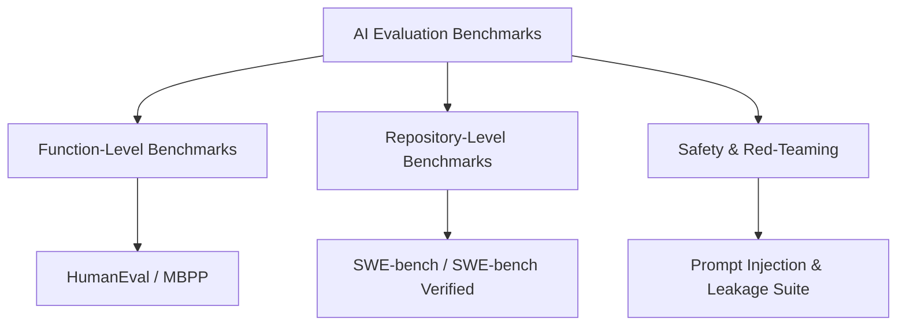

# Chapter 21: How to Evaluate AI: Benchmarks, Metrics, and Human Judgment

> 📝 **Coding Handbook**: Practice the code from this chapter → [`coding-handbook/ch21_evaluating_ai`](../coding-handbook/ch21_evaluating_ai/)

> *"A model scores 92% on HumanEval. Does that mean it can write production code? A model scores 87% on MMLU. Does that mean it understands medicine? The answer to both is: it depends entirely on what the benchmark actually measures."*

This chapter presents a comprehensive framework for evaluating AI systems: benchmark suites, unbiased metric estimators, LLM-as-Judge calibration, and AI safety red-teaming.

---

## 21.1 The Code Benchmark Landscape



### Critical Distinction: Function vs Repository Benchmarks
- **HumanEval / MBPP**: Measures function-level completion from docstrings (164 tasks). A model scoring $95\%$ on HumanEval may score only $20\%$ on real software engineering tasks.
- **SWE-bench**: Measures repository-level engineering (2,294 real GitHub issues). Evaluates multi-file AST parsing, git diff patches, and passing full pytest unit test suites.

---

## 21.2 Mathematical Formulation of Pass@k

To measure code completion accuracy without high sample variance, HumanEval uses the **unbiased hyper-geometric pass@k estimator**:

### Formula
$$\text{pass}@k = 1 - \frac{\binom{n - c}{k}}{\binom{n}{k}}$$

*where:*
- $n$: Total number of generated code samples per task ($n \ge k$).
- $c$: Number of samples that pass unit tests.
- $k$: Evaluated threshold ($k = 1, 5, 10$).

```python
import math

def estimate_pass_at_k(n: int, c: int, k: int) -> float:
    """Unbiased estimator for pass@k."""
    if n - c < k:
        return 1.0
    return 1.0 - (math.comb(n - c, k) / math.comb(n, k))
```

---

## 21.3 LLM-as-Judge Calibration & Bias Mitigation

Automated evaluation at scale uses strong models (e.g. Claude 3.5 Sonnet / GPT-4o) as judges to evaluate outputs.

### Known Judge Biases & Mitigation Strategies:
1. **Position Bias**: Judges favor the output presented first. *Mitigation: Swap response order and average scores.*
2. **Verbosity Bias**: Judges rate longer outputs higher. *Mitigation: Instruct rubric to enforce brevity constraints.*
3. **Self-Enhancement Bias**: GPT-4 rates GPT-4 outputs higher than Claude outputs. *Mitigation: Use cross-family judges or multi-judge consensus.*

---

## 21.4 AI Safety & Red-Teaming Suite

The safety evaluation suite tests agent resilience against adversarial inputs:
- **Prompt Injection Defense**: Evaluates resistance to overrides (`Ignore prior instructions`).
- **System Prompt Leakage**: Evaluates protection against key/prompt extraction.
- **Unauthorized Tool Gate**: Verifies blocking of destructive commands (`rm -rf`, `DROP TABLE`).
