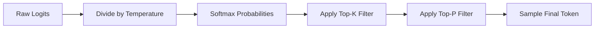

# Chapter 2: From Completion to Reasoning (Statistical Manipulation)

> 📝 **Coding Handbook**: Practice the code from this chapter → [`coding-handbook/ch02_reasoning`](../coding-handbook/ch02_reasoning/)

An LLM is a statistical engine. It outputs a probability distribution over its vocabulary (e.g., 100,277 tokens) indicating the likelihood of the next token. 

To build an agent, we must manipulate this distribution to suppress creative hallucination and force deterministic, logical output. 

## 2.1 The Mathematics of Sampling

When the final LayerNorm and Linear Projection are applied in the Transformer, we get raw unnormalized scores called **Logits** ($z$).

To pick the next word, we apply a Temperature-scaled Softmax:
$$ P(x_i) = \frac{\exp(z_i / T)}{\sum_j \exp(z_j / T)} $$

### Temperature ($T$)
- **$T = 1.0$:** Standard softmax.
- **$T \to 0$:** The largest logit dominates completely. The output becomes perfectly deterministic (Greedy Search).
- **$T > 1.0$:** The distribution flattens, making lower-probability tokens more likely.

**Agentic Implication:** For coding agents and tool-calling, **Temperature must be 0**. You want the exact function name, not a "creative" alternative.

### Nucleus Sampling (Top-P) and Top-K
Even at $T > 0$, we restrict the sample space to prevent wild hallucinations.
- **Top-K:** Only sample from the $K$ tokens with the highest probability.
- **Top-P:** Sort tokens by probability and only sample from the subset whose cumulative probability reaches $P$ (e.g., $0.9$).



## 2.2 Logit Bias and Schema Enforcement

When you ask an Agent to "output valid JSON," how does the API actually guarantee it? It doesn't just prompt-engineer; it manipulates the logits directly at the inference level.

### Structured Output (JSON Mode)
APIs like OpenAI's Structured Outputs build a Finite State Machine (FSM) based on your provided JSON Schema. 
During generation, if the FSM determines that the next character *must* be a quotation mark `"` to be valid JSON, the inference engine applies a massive negative Logit Bias (e.g., `-100`) to every single token in the vocabulary *except* `"`. 

The math literally forces the model into compliance.

```python
# Conceptual Implementation of Logit Bias for JSON enforcement
def apply_logit_bias(logits, allowed_tokens):
    """
    Forces the LLM to only pick from a subset of valid tokens.
    """
    for token_id in range(len(logits)):
        if token_id not in allowed_tokens:
            logits[token_id] = -float('inf') # Impossible to sample
    return logits
```

## 2.3 The Chain of Thought (CoT) Exploit

If we force the temperature to 0 and constrain the logits to JSON, the model is highly constrained. However, it still suffers from the lack of a "scratchpad". Because the model is auto-regressive, it cannot look ahead or compute intermediate steps in hidden layers.

**Chain of Thought (CoT)** exploits the auto-regressive loop. By forcing the model to output intermediate reasoning tokens, we feed those tokens back into the KV Cache (Chapter 1). The model's subsequent attention operations can now attend to its own computed logic.

### Exact CoT Architecture for Agents
In production agents (like Devin or Cursor's Composer), the System Prompt forces a specific schema that separates reasoning from action.

```xml
You must respond in the following format:
<thinking>
1. Evaluate the user request.
2. Identify the file path required.
3. Formulate the exact tool call arguments.
</thinking>
<tool_call>
{"name": "read_file", "path": "src/main.py"}
</tool_call>
```

By the time the model generates the `{"name": ...}` token, its $Q$ matrices are attending to the highly logical steps inside the `<thinking>` block, resulting in a drastically higher probability of a correct tool call.

In **Chapter 3**, we will build the exact network flow diagram for how an orchestrator manages this `<tool_call>` output, parsing it and executing it via the ReAct Paradigm.
