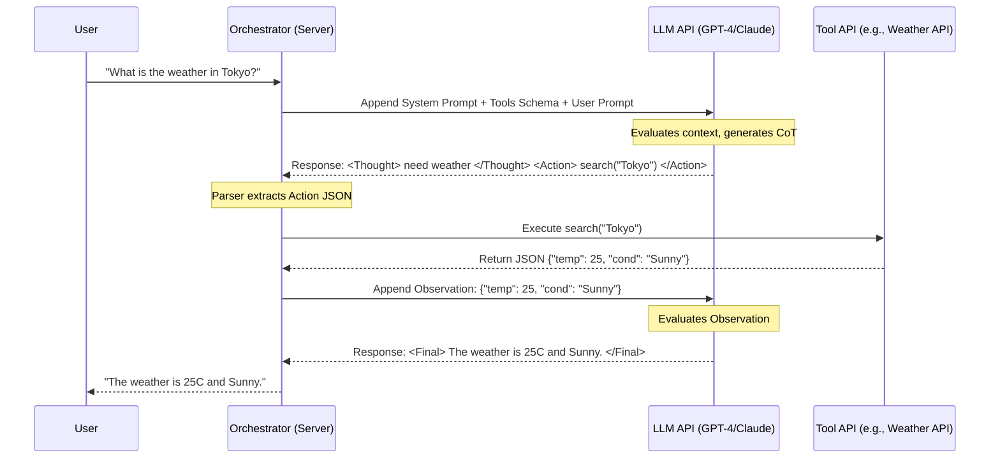

# Chapter 3: The ReAct Paradigm (Network & Execution Architecture)

> 📝 **Coding Handbook**: Practice the code from this chapter → [`coding-handbook/ch03_react`](../coding-handbook/ch03_react/)

The ReAct (Reasoning and Acting) loop is the central nervous system of an agent. It is a stateful, iterative execution cycle that connects the LLM's statistical logic to deterministic, real-world tools.

## 3.1 Sequence Diagram: The Orchestrator Loop

To understand ReAct in production, we must look at the exact network sequence between the User, the Orchestrator (your server), and the LLM API.



## 3.2 Production Challenges & Edge Cases

When you write a raw ReAct loop, 90% of your code handles failure. The LLM is non-deterministic, and APIs fail.

### 1. JSON Parsing Failures
LLMs often wrap their JSON output in Markdown backticks (e.g., ```json { ... } ```). A naive `json.loads()` will crash. You must write resilient parsers.

```python
import json
import re

def robust_json_parse(llm_output: str) -> dict:
    """Extracts and parses JSON even if wrapped in markdown or conversational text."""
    # Regex to find anything that looks like a JSON block
    match = re.search(r'\{.*\}', llm_output, re.DOTALL)
    if not match:
        raise ValueError("No JSON object found in output.")
        
    try:
        return json.loads(match.group(0))
    except json.JSONDecodeError as e:
        # Fallback: attempt to fix common LLM JSON errors (e.g., trailing commas)
        cleaned = re.sub(r',\s*}', '}', match.group(0))
        return json.loads(cleaned)
```

### 2. The Infinite Loop Problem
If an LLM writes an invalid SQL query, the Tool returns an error. The LLM might try the *exact same* invalid query again, creating an infinite loop that drains your API credits.

**Solution: State Hashing and Max Iterations.**
You must track the `sha256` hash of every `Action` payload. If the LLM proposes an action it has already tried in the current session, the Orchestrator must intercept it before executing the tool and inject a harsh system prompt: `"Error: You just tried this exact action and it failed. Try a completely different approach."`

Additionally, a hard limit (e.g., `max_iterations = 10`) must be enforced, at which point the Orchestrator gracefully terminates with a timeout error.

## 3.3 Network Resilience (Exponential Backoff)

The Orchestrator is highly susceptible to LLM API rate limits (HTTP 429). Because the loop might make 15 API calls in 30 seconds, you must implement exponential backoff on the API wrapper.

```python
import time
import random

def call_llm_with_backoff(messages, max_retries=5):
    for attempt in range(max_retries):
        try:
            # return openai.ChatCompletion.create(...)
            pass
        except Exception as e: # Catch HTTP 429 or 503
            if attempt == max_retries - 1:
                raise e
            sleep_time = (2 ** attempt) + random.uniform(0, 1)
            time.sleep(sleep_time)
```

By layering resilient parsing, loop prevention, and network backoff, you transform a fragile script into an enterprise-grade agent.
