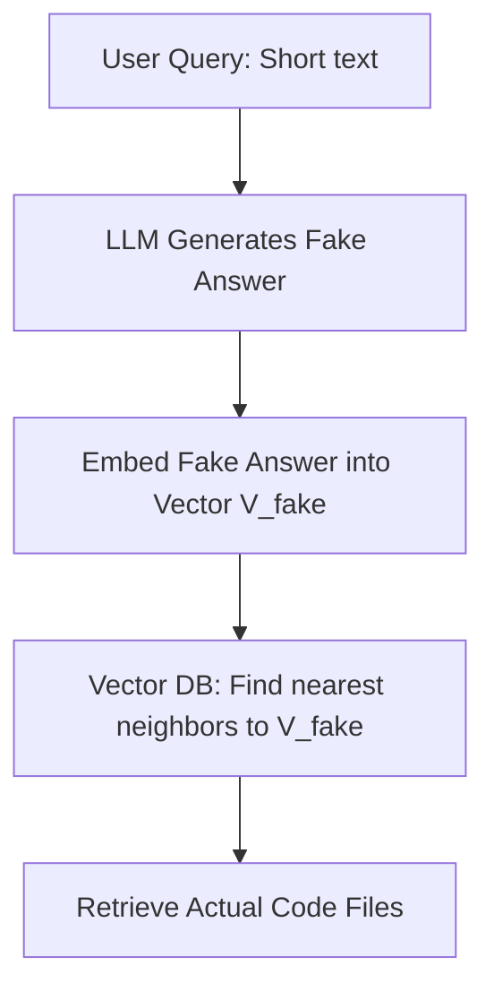

# Part III: Memory and Context (The RAG Pipeline)

> 📝 **Coding Handbook**: Practice the code from this chapter → [GitHub: ch05_embeddings](https://github.com/umang/agentic-ai-handbook/tree/main/coding-handbook/ch05_embeddings)
# Chapter 5: Embeddings & Asymmetric Search

To understand how an agent queries a massive codebase, you must understand the exact geometry of vector spaces and the distinction between Symmetric and Asymmetric search.

## 5.1 The Geometry of Embeddings

Modern models like `text-embedding-3-large` output arrays of 3,072 32-bit floating-point numbers. 
This means each file in your codebase occupies a single point in a 3,072-dimensional geometric space.

### The Memory Cost of Vectors
If your codebase has 10,000 files, and you chunk each file into 5 pieces, you have 50,000 vectors.
- 1 vector = 3,072 floats
- 1 float = 4 bytes
- 1 vector = 12,288 bytes (~12 KB)
- 50,000 vectors = **~600 MB of RAM** just to hold the vectors in memory (before any search index overhead).

## 5.2 Asymmetric vs. Symmetric Search

RAG systems fail because developers use the wrong search paradigm.

### Symmetric Search
The query and the document are of similar length and structure.
- *Example:* Comparing the similarity of two news articles.

### Asymmetric Search (Agentic Standard)
The query is very short, and the document is very long.
- *Query:* "Where is the database connection?" (6 words)
- *Document:* A 500-line `psycopg2` Python file.

**The Problem:** If you embed a 6-word question, its vector will point toward "question-like" semantics. If you embed a 500-line code file, its vector points toward "Python code" semantics. The Cosine Similarity between them might be very low, even if the file contains the exact answer.

### The Solution: HyDE (Hypothetical Document Embeddings)

To fix the Asymmetric search problem, advanced agents use HyDE.

1. **User asks:** "Where is the DB connection?"
2. **Agent LLM generates a fake answer:** "The DB connection is located in `src/db/connection.py` using `psycopg2.connect(...)`."
3. **Embed the fake answer:** We create a vector from the LLM's hallucinated response.
4. **Vector Search:** We use the *fake answer's vector* to search the Vector DB. Because the fake answer matches the length and structure of real code, the Cosine Similarity calculation is highly accurate and retrieves the *real* `connection.py` file.

This transforms a weak Asymmetric search into a powerful Symmetric search, a technique used heavily by tools like Cursor to find obscure code definitions.
