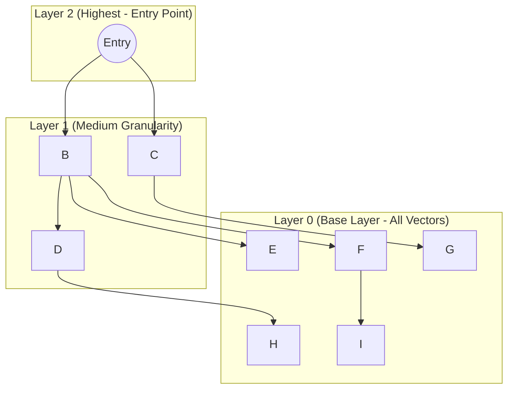

# Chapter 6: Building a Vector Database (HNSW & AST)

> 📝 **Coding Handbook**: Practice the code from this chapter → [`coding-handbook/ch06_vector_db`](../coding-handbook/ch06_vector_db/)

In Chapter 5, we calculated memory for vectors. If you have 10 million vectors, computing the exact Cosine Similarity for every single vector sequentially ($O(N)$) for every user prompt will take seconds or minutes. 

Production Vector DBs (Pinecone, Qdrant) solve this using **Approximate Nearest Neighbor (ANN)** search algorithms, the most prominent being **HNSW (Hierarchical Navigable Small World)**.

## 6.1 The HNSW Graph Search Algorithm

HNSW works similarly to a Skip List combined with a social network graph.



**How it works:**
1. The search starts at the highest, sparsest layer.
2. It evaluates the few connected nodes to see which vector is mathematically "closer" to the query vector.
3. It drops down to the next layer and repeats the greedy search, zeroing in on the target cluster.
4. At the base layer, it finds the absolute nearest neighbors.

This reduces the search complexity from $O(N)$ to $O(\log(N))$, allowing agents to search millions of code chunks in milliseconds.

## 6.2 Abstract Syntax Tree (AST) Chunking

As mentioned, feeding a Vector DB arbitrary string chunks ruins semantic search. If a chunk splits a Python function in half, the vector is garbage.

Production agents parse the **Abstract Syntax Tree (AST)** using libraries like `Tree-sitter` to chunk code exactly at the function/class level.

### Code: AST Chunking in Python (Conceptual)

```python
import ast

def extract_functions_from_code(source_code):
    """
    Parses Python code and chunks it strictly by function definitions.
    """
    parsed_ast = ast.parse(source_code)
    chunks = []
    
    for node in ast.walk(parsed_ast):
        if isinstance(node, ast.FunctionDef):
            # Extract the raw source code of just this function
            func_code = ast.unparse(node) 
            
            chunk = {
                "name": node.name,
                "code": func_code,
                "type": "function",
                "char_length": len(func_code)
            }
            chunks.append(chunk)
            
    return chunks

# Example Code File
sample_file = """
import os

def load_data():
    return os.listdir()

def process_data(data):
    for d in data:
        print(d)
"""

# Extracting chunks
ast_chunks = extract_functions_from_code(sample_file)
for c in ast_chunks:
    print(f"Vectorize -> {c['name']} (Length: {c['char_length']})")
```

By passing `ast_chunks` into your embedding model, your Vector DB is populated with pure, atomic logic blocks. When the agent asks for `load_data()`, the HNSW graph will retrieve exactly the 2 lines of code representing that function, rather than an arbitrary 500-character slice of the file.
