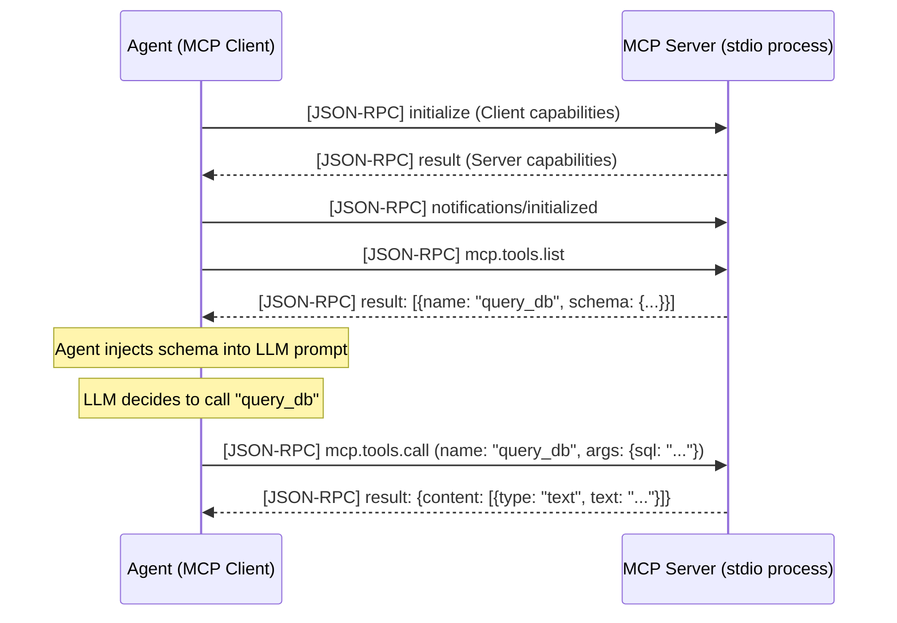

# Chapter 9: The Model Context Protocol (JSON-RPC & STDIO)

> 📝 **Coding Handbook**: Practice the code from this chapter → [`coding-handbook/ch09_mcp`](../coding-handbook/ch09_mcp/)

The Model Context Protocol (MCP) solves the N-to-N integration problem in Agentic AI. 

Without MCP, if you write an Agent to query a Postgres DB, read Jira tickets, and list S3 buckets, you must write three custom Python integrations and manually stitch their JSON schemas into your Agent's tool payload.

With MCP, you write isolated "Servers." The Agent (the Client) connects to the Servers, negotiates capabilities, and dynamically fetches the tool schemas.

## 9.1 The Client-Server Negotiation (Sequence Diagram)

MCP operates over standard transport layers: usually `stdio` (Standard Input/Output) for local processes, or `SSE` (Server-Sent Events) for remote APIs. The protocol is strictly **JSON-RPC 2.0**.



## 9.2 The Exact JSON-RPC Lifecycle Over STDIO

When Cursor connects to a local MCP server, it spawns a child process and communicates via stdin/stdout. Here is the raw payload structure.

### 1. The Initialization Request (Client -> Server)
```json
{
  "jsonrpc": "2.0",
  "id": 1,
  "method": "initialize",
  "params": {
    "protocolVersion": "2024-11-05",
    "capabilities": {
      "roots": {"listChanged": true},
      "sampling": {}
    },
    "clientInfo": {
      "name": "Cursor",
      "version": "0.40.1"
    }
  }
}
```

### 2. The Tool List Request (Client -> Server)
```json
{
  "jsonrpc": "2.0",
  "id": 2,
  "method": "tools/list",
  "params": {}
}
```

### 3. The Server Response (Server -> Client)
```json
{
  "jsonrpc": "2.0",
  "id": 2,
  "result": {
    "tools": [
      {
        "name": "read_jira_ticket",
        "description": "Fetches a Jira ticket by ID.",
        "inputSchema": {
          "type": "object",
          "properties": {
            "ticket_id": {"type": "string"}
          },
          "required": ["ticket_id"]
        }
      }
    ]
  }
}
```

By adhering strictly to this JSON-RPC format, any MCP-compatible IDE or Agent can instantly inherit the capabilities of any MCP Server without writing a single line of custom integration code.
